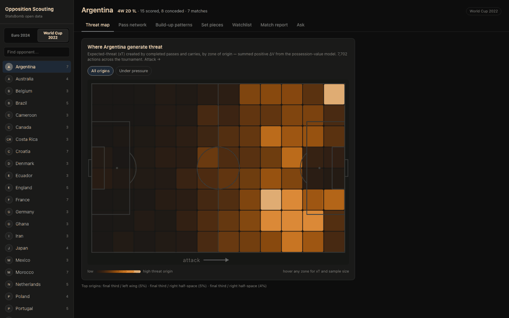
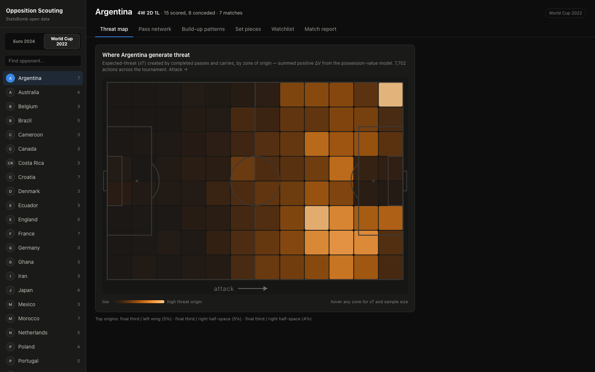
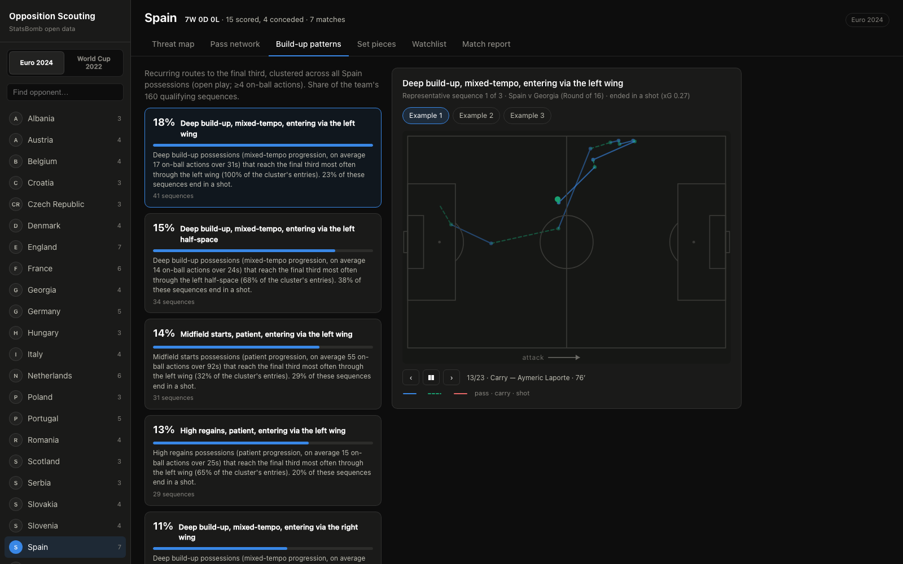
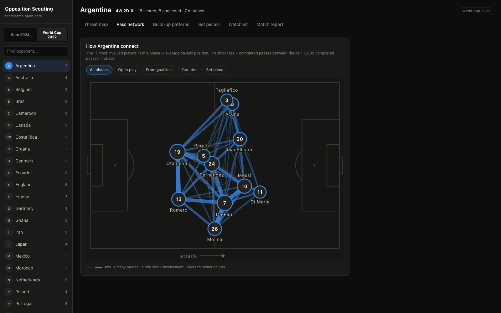
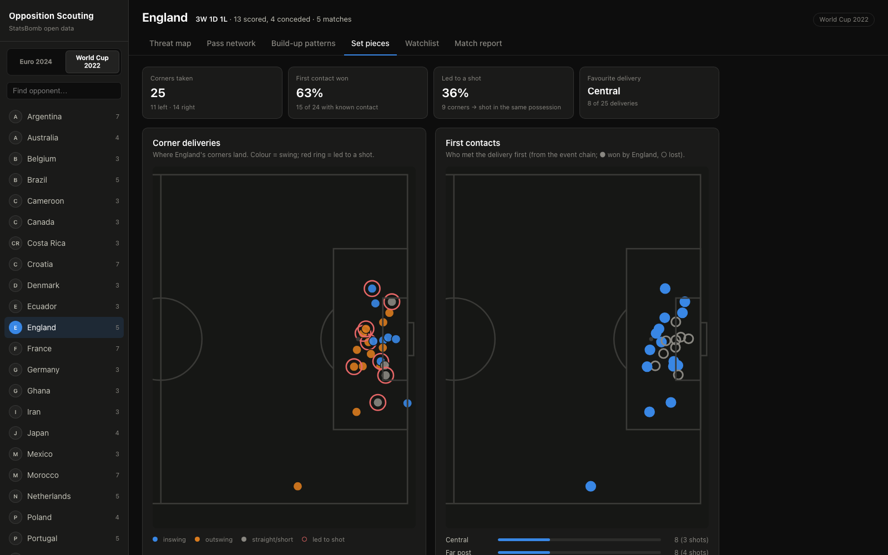

# Opposition Scouting Dashboard

An end-to-end tool for match analysts: pick an opponent and a tournament, get a
data-driven tactical profile in seconds — where they generate danger, how they
build up, who to watch, and what they do from corners. Built on
[StatsBomb open data](https://github.com/statsbomb/open-data) for the **2022 FIFA
World Cup** and **UEFA Euro 2024** (115 matches, 48 national teams, including 360
freeze-frames), switchable from a single toggle, with an expected-threat model
(PyTorch) underneath. Adding another competition is a one-line config change plus
a pipeline re-run.

**The persona behind every decision:** an analyst preparing on a Tuesday for a
Saturday fixture. Fast loads, plain language, sensible defaults, minimal clicks
to insight. Product judgment — what I'd validate with analysts before building
more, and what was deliberately cut — is recorded in [`ROADMAP.md`](ROADMAP.md).



| | |
|---|---|
|  |  |
| *Threat map — where Argentina generate xT* | *Build-up patterns — Spain's routes, replayable* |
|  |  |
| *Pass network — phase-filterable* | *Set pieces — deliveries & first contacts* |

## What it does

| View | The question it answers |
|---|---|
| **Threat map** | Where does this opponent generate danger from? (xT by zone of origin, interactive pitch heatmap) |
| **Pass network** | Who connects with whom, filterable by phase (open play / goal kicks / counters / set pieces) |
| **Build-up patterns** | Their recurring routes to the final third — clustered, ranked by share, each replayable step-by-step on the pitch |
| **Set pieces** | Corner delivery zones, in/out-swing, first-contact outcomes |
| **Watchlist** | Top opponent players by threat created per 90, with generated one-line scouting notes |
| **Match report** | A one-page printable summary a coach can read in two minutes |

## Architecture

```
statsbomb/open-data (raw JSON)
        │  python -m pipeline download
        ▼
   /pipeline  ── Polars parse/clean ──► PostgreSQL (normalised schema)
        │                                  events · freeze_frames · matches …
        │  python -m pipeline derive
        ▼
   derived tables: sequences · pass_edges/nodes · set_pieces · player_minutes
        │
   /ml ── PyTorch xT model (train → apply) ──► zone_threat · player_threat
       └─ k-means sequence clustering ──► pattern_clusters · team_patterns
        │
        ▼
   /backend  FastAPI (read-only, precomputed) ──► /frontend  React + TS + d3
```

- **`/pipeline`** — download + ingestion (Polars), schema DDL, derived metrics
- **`/ml`** — xT model, clustering, evaluation notebook, [`EVALUATION.md`](ml/EVALUATION.md)
- **`/backend`** — FastAPI service; every endpoint reads precomputed tables
- **`/frontend`** — Vite + React + strict TypeScript, d3-rendered SVG pitches, dark analysis-room theme

## Run it

Prereqs: Docker, [uv](https://docs.astral.sh/uv/), Node 22+.

```bash
# 1. Postgres + (later) the app
docker compose up -d db

# 2. Data: download → ingest → derive   (~1.1 GB of JSON, a few minutes)
uv sync --all-packages
uv run python -m pipeline download
uv run python -m pipeline init-db
uv run python -m pipeline ingest
uv run python -m pipeline verify --match-id 3857254   # checks DB against raw JSON
uv run python -m pipeline derive --skip-xt

# 3. ML: train the xT model, credit actions, cluster build-up patterns
uv run python -m ml.train
uv run python -m ml.xt_apply
uv run python -m ml.cluster

# 4. Serve
uv run uvicorn backend.main:app --port 8000     # API
cd frontend && npm install && npm run dev        # dashboard at localhost:5173
```

Or, once the database is populated: `docker compose up --build` serves the full
app (API + built frontend) at `localhost:8000`.

**Tests / checks** (same as CI):

```bash
uv run ruff check pipeline backend ml
uv run mypy pipeline/src backend/src ml/src      # strict
uv run pytest pipeline/tests backend/tests ml/tests
cd frontend && npm run lint && npm run build && npm test
```

Deployment config for Fly.io is in [`fly.toml`](fly.toml) (single app image +
attached Fly Postgres; the pipeline loads data from your machine through
`fly proxy` — the serving image never computes anything).

## The ML, briefly

**Expected threat (xT).** A small PyTorch MLP learns V(x, y): the probability-
weighted shot value (xG) a possession produces within its next 5 actions from a
given ball position. Every completed pass and carry is credited with
ΔV = V(end) − V(start); the dashboard aggregates positive ΔV ("threat created")
by zone and by player, always per tournament. One model is trained across both
tournaments (~330k on-ball actions) with a **match-level** train/validation
split. Validation: 25% better BCE than the base-rate baseline, a perfectly
monotonic threat surface toward goal, and **Spearman ρ = 0.985** against Karun
Singh's independently derived public xT grid. The players it rates highest —
Dembélé, Di María, Musiala at WC 2022; Lamine Yamal, Doku, Nico Williams at
Euro 2024 — pass the eye test without the model ever seeing a player name. Full write-up: [`ml/EVALUATION.md`](ml/EVALUATION.md),
reproducible notebook: [`ml/notebooks/xt_evaluation.ipynb`](ml/notebooks/xt_evaluation.ipynb).

**Build-up patterns.** Possession sequences reaching the final third are
described by start zone, progression, directness, tempo, width and lane of
final-third entry, then clustered with k-means (k = 8, one global model so
labels are comparable across teams). Each team's profile shows its top clusters
with plain-language descriptions ("Deep build-up, entering via the right
half-space — 22% of sequences") and real replayable example sequences. The
clustering is one global model over both tournaments, so a pattern label means
the same thing whichever competition the toggle shows.

## Design decisions (analyst-first)

- **Tournaments never mix.** Per-team aggregates carry a competition/season
  key end to end (schema → API → URL), so Spain's Euro 2024 profile can never
  bleed into their World Cup one; a team absent from the selected tournament is
  a 404, not an empty chart. (WC 2026 isn't in the open data — when a new
  tournament lands, it's one line in `pipeline/config.py`.)
- **Everything is precomputed at ingestion.** An analyst opening the tool 20
  minutes before a meeting cannot wait for on-demand computation. The API only
  ever reads indexed, derived tables; the heaviest per-request work is fetching
  the ~12 events of one example sequence.
- **Plain language.** Cluster descriptions, scouting notes and the match report
  are generated in coach-readable sentences, and use football terms correctly
  (half-spaces, build-up, first contact) rather than model terms (centroids, ΔV).
- **Sample sizes are always visible.** A World Cup gives 3–7 matches per team.
  Every heatmap tooltip, pattern card and stat tile carries its n. The report
  footer says outright: treat 3-match teams with caution.
- **One deeply polished insight per view.** Each tab answers exactly one
  question an analyst actually asks; the threat map and the pattern player got
  the most attention, per the project brief.
- **The pass network shows 11 players, not 26.** A tournament squad on one
  pitch is unreadable; the 11 most involved in the selected phase is what an
  analyst would draw by hand.
- **Dark analysis-room theme, print-light report.** The dashboard is built for
  a dark video room; the one thing that leaves the room — the match report —
  prints on white with print CSS.
- **Honest ML.** The xT model is evaluated against a match-held-out split, an
  external reference grid, and football intuition — and its limitations
  (position-only value, small samples, set-piece inheritance) are documented
  where they matter.

## Data attribution

Uses [StatsBomb open data](https://github.com/statsbomb/open-data) under their
non-commercial licence — thanks to StatsBomb for making serious event data
public. This project is a portfolio piece, not a commercial product.
