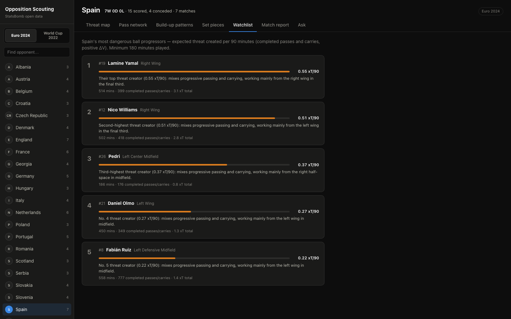
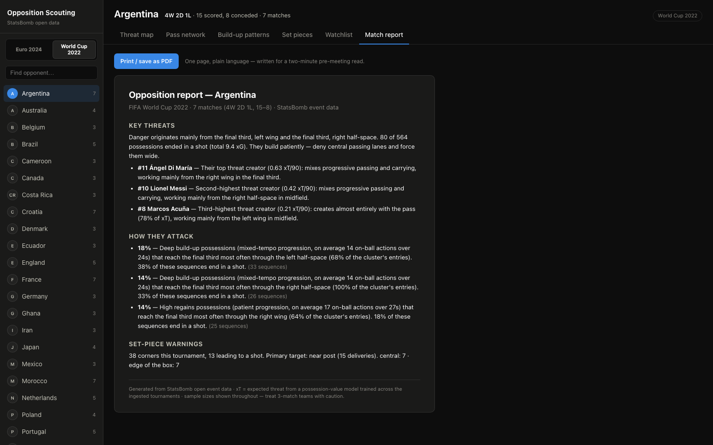
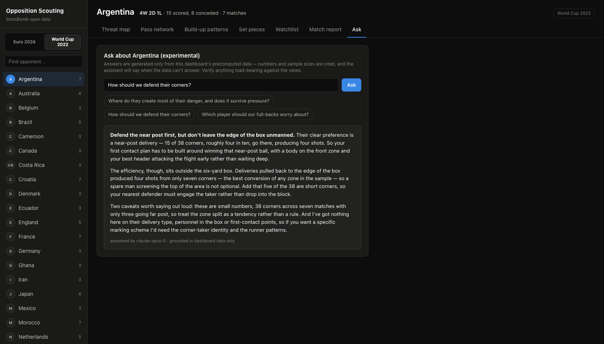

# Opposition Scouting Dashboard

An end-to-end tool for match analysts: pick an opponent and a tournament, get a
data-driven tactical profile in seconds; where they generate danger, how they
build up, who to watch, and what they do from corners. Built on
[StatsBomb open data](https://github.com/statsbomb/open-data) for the **2022 FIFA
World Cup** and **UEFA Euro 2024** (115 matches, 48 national teams, including 360
freeze-frames), switchable from a single toggle, with an expected-threat model
(PyTorch) underneath. Adding another competition is a one-line config change plus
a pipeline re-run.


| | |
|---|---|
|  |  |
| *Threat map - where Argentina generate xT* | *Build-up patterns - Spain's routes, replayable* |
|  |  |
| *Pass network - phase-filterable* | *Set pieces — deliveries & first contacts* |
|  |  |
| *Watchlist - top threat creators, with generated notes* | *Match report - printable one-pager* |
|  | |
| *Ask (optional) - grounded in the tables above, and candid about what the data can't tell you* | |

## What it does

| View | The question it answers |
|---|---|
| **Threat map** | Where does this opponent generate danger from? Interactive xT heatmap by zone of origin, with an **under-pressure** toggle showing which of that threat survives being pressed |
| **Pass network** | Who connects with whom, filterable by phase (open play / goal kicks / counters / set pieces) |
| **Build-up patterns** | Their recurring routes to the final third; clustered, ranked by share, each replayable step-by-step on the pitch |
| **Set pieces** | Corner delivery zones, in/out-swing, first-contact outcomes |
| **Watchlist** | Top opponent players by threat created per 90, with generated one-line scouting notes |
| **Match report** | A one-page printable summary a coach can read in two minutes |
| **Ask** *(optional)* | Natural-language questions answered strictly from the tables above, off unless an API key is configured |

## Architecture

```
statsbomb/open-data (raw JSON)
        │  python -m pipeline download
        ▼
   /pipeline  ── Polars parse/clean ──► PostgreSQL (normalised schema)
        │                                  events · freeze_frames · matches …
        │  python -m pipeline derive
        ▼
   derived tables: sequences · pass_edges/nodes · set_pieces · player_minutes
        │
   /ml ── PyTorch xT model (train → apply) ──► zone_threat · player_threat
       └─ k-means sequence clustering ──► pattern_clusters · team_patterns
        │
        ▼
   /backend  FastAPI (read-only, precomputed) ──► /frontend  React + TS + d3
        └─ optional /ask ──► Claude API, grounded only in the tables above
```

- **`/pipeline`** - download + ingestion (Polars), schema DDL, derived metrics
- **`/ml`** - xT model, clustering, evaluation notebook, [`EVALUATION.md`](ml/EVALUATION.md)
- **`/backend`** - FastAPI service; every endpoint reads precomputed tables. The
  optional `/ask` endpoint is the one exception that talks to an external API,
  and it is disabled unless a key is present
- **`/frontend`** - Vite + React + strict TypeScript, d3-rendered SVG pitches, dark analysis-room theme

## Run it

Prereqs: Docker, [uv](https://docs.astral.sh/uv/), Node 22+.

```bash
./run.sh setup    # first time only: download, ingest, derive, train (~15 min)
./run.sh          # start Postgres, the API and the dashboard
```

`run.sh` frees its own ports if something is already listening, waits for
Postgres, refuses to start against an empty database (pointing you at `setup`),
and shuts both servers down cleanly on Ctrl-C. `./run.sh status` shows what's
up; `./run.sh stop` stops everything.

<details>
<summary>Or run each step by hand</summary>

```bash
# 1. Postgres + (later) the app
docker compose up -d db

# 2. Data: download → ingest → derive   (~1.1 GB of JSON, a few minutes)
uv sync --all-packages
uv run python -m pipeline download
uv run python -m pipeline init-db
uv run python -m pipeline ingest
uv run python -m pipeline verify --match-id 3857254   # checks DB against raw JSON
uv run python -m pipeline derive --skip-xt

# 3. ML: train the xT model, credit actions, cluster build-up patterns
uv run python -m ml.train
uv run python -m ml.xt_apply
uv run python -m ml.cluster

# 4. Serve
uv run uvicorn backend.main:app --port 8000     # API
cd frontend && npm install && npm run dev        # dashboard at localhost:5173
```

</details>

Or, once the database is populated: `docker compose up --build` serves the full
app (API + built frontend) at `localhost:8000`. Note that container also
publishes port 8000, so stop it (`docker compose stop app`) before running the
dev servers, or it will shadow them.

**Tests / checks** (same as CI):

```bash
uv run ruff check pipeline backend ml
uv run mypy pipeline/src backend/src ml/src      # strict
uv run pytest pipeline/tests backend/tests ml/tests
cd frontend && npm run lint && npm run build && npm test
```

## Automation — the Monday-morning routine

Two commands take an analyst from "new data exists" to "printed packs on the
coaches' desks":

```bash
# refresh everything (idempotent download, full reload, re-derive, re-credit)
uv run python -m pipeline download && uv run python -m pipeline ingest && \
  uv run python -m pipeline derive --skip-xt && uv run python -m ml.xt_apply && \
  uv run python -m ml.cluster

# render printable PDF reports for any fixture list (or --all for a tournament)
uv run python -m pipeline matchpack --teams "Spain,France" --comp 43-106 --out matchpacks
```

`matchpack` drives headless Chrome against the running app, so the PDFs are
pixel-identical to the dashboard's print view — one source of truth for
on-screen and on-paper.

## Optional: the experimental "Ask" tab

A Q&A tab answers questions in plain English *"how should we defend their
corners?"*, strictly from the dashboard's own precomputed tables, via the
Claude API (`claude-opus-5`). It is **off by default**: the core product never
depends on an external API.

The grounding is the point. The model is handed one bundle assembled from the
same tables the views read; record, threat zones with their pressure split,
build-up clusters, corner zones, watchlist and is instructed to answer only
from it, cite the numbers and sample sizes that carry the argument, and say
plainly when the data cannot answer rather than guessing. It gets no outside
knowledge about teams or players. Treat it as a fast way to interrogate the
data, not as a source of truth: verify anything load-bearing against the views.

```bash
cp .env.example .env      # then paste your key into ANTHROPIC_API_KEY=
./run.sh                  # restart; the "Ask" tab appears
```

Get a key from [console.anthropic.com](https://console.anthropic.com/settings/keys)
- pay-as-you-go, separate from any Claude subscription.

## Deployment

Config for Fly.io is in [`fly.toml`](fly.toml): a single app image plus an
attached Fly Postgres. The serving image contains no pipeline or ML code, so the
database is loaded from your machine through `fly proxy`, the commands are in
the comments at the top of that file.

## The ML, briefly

**Expected threat (xT).** A small PyTorch MLP learns V(x, y): the probability 
weighted shot value (xG) a possession produces within its next 5 actions from a
given ball position. Every completed pass and carry is credited with
ΔV = V(end) − V(start); the dashboard aggregates positive ΔV ("threat created")
by zone and by player, always per tournament. One model is trained across both
tournaments (~330k on-ball actions) with a **match-level** train/validation
split. Validation: 25% better BCE than the base-rate baseline, a perfectly
monotonic threat surface toward goal, and **Spearman ρ = 0.985** against Karun
Singh's independently derived public xT grid. The players it rates highest;
Dembélé, Di María, Musiala at WC 2022; Lamine Yamal, Doku, Nico Williams at
Euro 2024 — pass the eye test without the model ever seeing a player name. Full write-up: [`ml/EVALUATION.md`](ml/EVALUATION.md),
reproducible notebook: [`ml/notebooks/xt_evaluation.ipynb`](ml/notebooks/xt_evaluation.ipynb).

**Does defensive context matter?** The 360 freeze-frames let us test whether the
defensive picture adds signal beyond ball position. Two identical MLPs, same
match-level split, same budget, on the 88% of on-ball actions a freeze-frame
covers: position-only scores 0.02375 validation BCE, position plus defender
context (nearest defender, bodies goal-side, bodies inside the ball-to-goal
cone) scores **0.02301**, a real 3.1% gain, but a small one. Position dominates.
A useful by-product: the 360 geometry independently validates StatsBomb's
`under_pressure` flag, with a median nearest defender of 2.5 pitch units when
the flag is set versus 6.5 when it isn't. The deployed scorer therefore stays
position-only, crediting an action needs V at its *end* location, where no
freeze-frame exists and the threat map's under-pressure toggle is built on
that validated flag instead, which has full coverage and needs no inference.
Run it with `python -m ml.pressure_ablation`.

**Build-up patterns.** Possession sequences reaching the final third are
described by start zone, progression, directness, tempo, width and lane of
final-third entry, then clustered with k-means (k = 8, one global model so
labels are comparable across teams). Each team's profile shows its top clusters
with plain-language descriptions ("Deep build-up, entering via the right
half-space, 22% of sequences") and real replayable example sequences. The
clustering is one global model over both tournaments, so a pattern label means
the same thing whichever competition the toggle shows.

## Data attribution

Uses [StatsBomb open data](https://github.com/statsbomb/open-data) under their
non-commercial licence. This project is a portfolio piece, not a commercial product.
